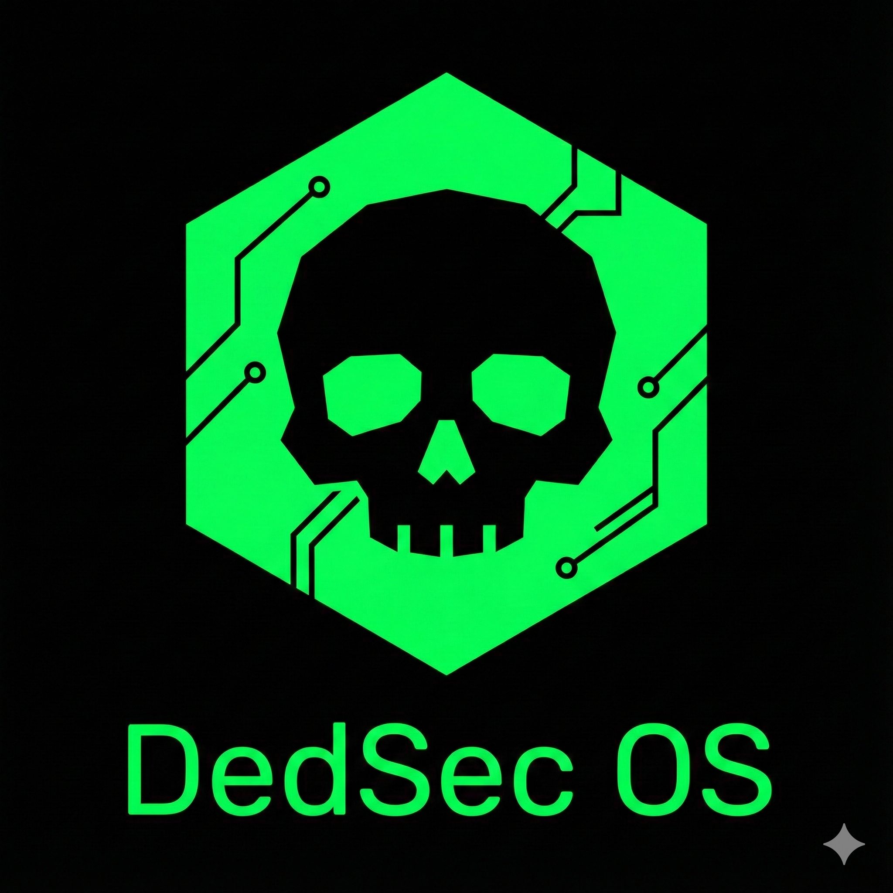

<p align="center">
  
</p>

# DedSecOS

[](https://opensource.org/licenses/MIT)
[](https://www.python.org/downloads/)
[](https://github.com/psf/black)
[](https://github.com/canonrebel04/dedsec-os/actions/workflows/ci.yml)

> A cyberpunk-themed security toolkit UI for Raspberry Pi with PiTFT touchscreen

<p align="center">
  
</p>

## ✨ Features

- 🖥️ **Cyberpunk UI** - Neon green terminal aesthetic with multiple themes
- 🔧 **Security Tools** - Port scanner, ARP scanner, network utilities
- 📱 **Touchscreen Optimized** - Designed for PiTFT 2.8" resistive display
- 🎨 **Themeable** - 5 built-in themes (Neon Green, Synthwave, Monochrome, Acid Trip, Stealth)
- 🏗️ **MVC Architecture** - Clean, modular, and extensible codebase
- 📊 **Real-time Diagnostics** - FPS counter, memory tracker, CPU monitor

## 🚀 Quick Start

### Prerequisites

- Raspberry Pi (3B+ or newer recommended)
- PiTFT 2.8" Resistive Touchscreen
- Python 3.9+
- Raspbian/Raspberry Pi OS

### Installation

```bash
# Clone the repository
git clone https://github.com/dedsec-team/dedsec-os.git
cd dedsec-os

# Create virtual environment (recommended)
python3 -m venv venv
source venv/bin/activate

# Install dependencies
pip install -e .

# For development
pip install -e ".[dev]"
```

### Running

```bash
# Start the UI
python app.py

# Or use the entry point
dedsec
```

## 📁 Project Structure

```
dedsec-os/
├── app.py              # Main application entry point
├── ui/                 # UI Framework
│   ├── architecture.py # MVC base classes
│   ├── components.py   # UI widgets (Button, Modal, etc.)
│   ├── themes.py       # Theme system
│   ├── rendering.py    # Canvas rendering
│   ├── animations.py   # Visual effects
│   └── diagnostics.py  # Performance monitoring
├── core/               # Core utilities
│   ├── logging.py      # Logging system
│   └── ...
├── config/             # Configuration files
├── scripts/            # Deployment scripts
├── tests/              # Unit tests
└── docs/               # Documentation
```

## 🎨 Themes

Switch between themes at runtime:

```python
from ui.themes import ThemeManager

tm = ThemeManager()
tm.set_theme("synthwave")  # Options: neon_green, synthwave, monochrome, acid_trip, stealth_mode
```

## 🧪 Testing

```bash
# Run all tests
pytest

# Run with coverage
pytest --cov=ui --cov=core

# Run specific test file
pytest tests/test_components.py -v
```

## 🛠️ Development

### Code Style

This project uses:
- **Black** for code formatting
- **Ruff** for linting
- **MyPy** for type checking

```bash
# Format code
black .

# Lint
ruff check .

# Type check
mypy ui/ core/
```

### Pre-commit Hooks (Optional)

```bash
pip install pre-commit
pre-commit install
```

## 📖 Documentation

- [Developer Guide](docs/DEVELOPER_GUIDE.md)
- [API Reference](docs/API.md)
- [Deployment Guide](docs/DEPLOYMENT.md)

## 🤝 Contributing

1. Fork the repository
2. Create a feature branch (`git checkout -b feature/amazing-feature`)
3. Commit your changes (`git commit -m 'Add amazing feature'`)
4. Push to the branch (`git push origin feature/amazing-feature`)
5. Open a Pull Request

### Branching Strategy

- `main` - Stable production code
- `develop` - Active development
- `feature/*` - New features
- `bugfix/*` - Bug fixes
- `release/*` - Release preparation

## 📋 Roadmap

- [ ] Web UI interface
- [ ] Plugin system for custom tools
- [ ] Remote management API
- [ ] Additional security tools
- [ ] Bluetooth integration

## 📄 License

This project is licensed under the MIT License - see the [LICENSE](LICENSE) file for details.

## 🙏 Acknowledgments

- Inspired by Watch Dogs DedSec aesthetic
- Built for the Raspberry Pi community
- Uses [scapy](https://scapy.net/) for network operations

---

<p align="center">
  Made with 💚 by the DedSec Team
</p>
